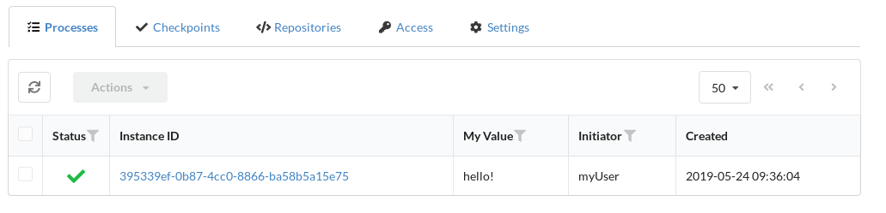
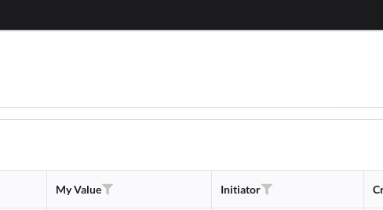

# {{ page.title }} 

A process is the execution of a workflow defined by the combination of request
data, a user's files, project templates, and the contents of a repository. These
four components result in a specific process that is executed. This process and
its details can be inspected in the Concord Console.

A simple example can be the execution of a simple logging task to print `Hello
World` in the log as shown in the
[quickstart](../getting-started/quickstart.html).

The Concord Console provides comprehensive access to process data on the
_Processes_ list as well as in a separate view for a specific process.

<a name="metadata"/>

## Process Metadata

Metadata exposed in the [process
configuration](../getting-started/concord-dsl.html#metadata) can be used to
customize the data shown in the process list. For example, specific variables
from the metadata can be used in additional columns and/or filters.

The process list configuration can be set per project or per organization. For
example, if the process exposes `myValue` variable in the metadata, then in
order to a add `myValue` column to the project's process list, the project's
configuration can look like this:

```bash
$ curl -ikn -H 'Content-Type: application/json' -d @body.json http://concord.example.com/api/v1/org/MyOrg/project
```

where `body.json` is

```json
{
    "name": "MyProject",
    "meta": {
        "ui": {
            "processList": [
                {
                    "builtin": "status"
                },
                {
                    "builtin": "instanceId"
                },
                {
                    "source": "meta.myValue",
                    "caption": "My Value",
                    "searchType": "substring",
                    "searchValueType": "string"
                },
                {
                    "builtin": "initiator"
                },
                {
                    "builtin": "createdAt"
                }
            ]
        }
    }
}
```

The process list should look like this:



The `processList` value is a list of column definitions. Each column definition
has the following structure:

- `builtin` - reference to one of the [built-in columns](#built-in-columns).
  Built-in columns are useful to avoid repetition in column definitions;
- `caption` - string, the displayed name of the column. Mandatory for
  non-built-in columns;
- `source` - string, the value's source in the process entry, mandatory.
  Metadata variables start with the `meta.` prefix;
- `textAlign` - optional, the alignment of the column's caption: `center`,
  `left` or `right`;
- `collapsing` - optional, boolean value. If `true` the column will be resized
  down to the length of the data;
- `render` - optional, how the values should be rendered:
  - `process-status` - as a status icon;
  - `process-link` - with a link to the process' details;
  - `project-link` - with a link to the process' project;
  - `repo-link` - with a link to the process' repository;
  - `timestamp` - formatted as a date-time value.
- `searchValueType` - optional, how the value should be treated when the
  filtering is used. Currently accepts only `string`;
- `searchType` - optional, how the filtering should work for this column:
  - `substring` - partial match;
  - `equals` - full match.
- `searchOptions` - optional, a list of values for the dropdown element of the
  column filter. See [the examples](#examples).

### Build-in Columns

Concord Console provides several built-in column types, that can be used in
the process list configuration:

- `status` - the process' status icon;
- `instanceId` - the process' ID with a link to the process' details;
- `projectName` - the process' project with a link to the project's process
  list;
- `repoName` - the process' repository with a link to the project's repository;
- `initiator` - the process initiator's user name;
- `createdAt` - date-time of the process creation;
- `lastUpdatedAt` - date-time when the process was last seen alive.

### Examples

A column with a dropdown filter:

```json
{
    "meta": {
        "ui": {
            "processList": [
                {
                    "source": "meta.MyValue",
                    "caption": "My Value",
                    "searchType": "equals",
                    "searchValueType": "string",
                    "searchOptions": [
                        {
                            "value": "abc",
                            "text": "My ABC value"
                        },
                        {
                            "value": "xyz",
                            "text": "My XYZ value"
                        }
                    ]
                }
            ]
        }
    }
}
```

The column's filter will look like this:


