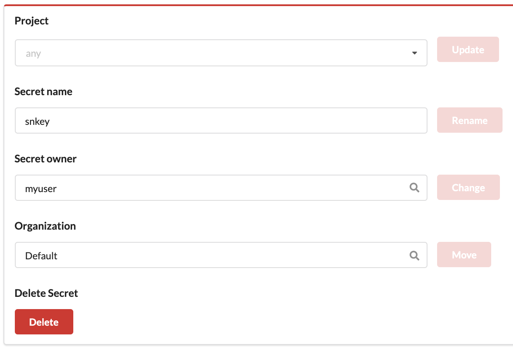

# {{ page.title }}

Secrets are protected information associated with an
[organization](./organization.html). Secrets are created with the Concord
Console or the API, and can be used from a Concord flow.

A number of different secrets are supported.

- SSH keys signed by the Concord Server
- files containing secrets
- username/password combinations
- password values

Concord UI allows several changes to be made to a secret if the user has either
`WRITER` or higher access to it -

- [Move Secret to a Different Organization](#move-secret-to-a-different-organization)
- [Update Secret Owner or Project OR Delete Secret](#update-secret-owner-or-project-or-delete-secret)

### Move Secret to a Different Organization

A secret, after it is created in an organization, can be moved to a different
organization to which the user must have access to (`WRITER` or above).

This can be done with the Concord Console or by using the REST API.

1. Login to the Console of your Concord instance

    

2. Navigate to the settings tab of the secret to be moved.

    _Organizations -> Select Organization -> Select Secret -> Settings_

    

3. Scroll down to **`Danger Zone`** and enter the Organization name to which
   the secret has to be moved to, and select it.

    _current organization_

    

    _changed organization_

    

    Click on *`Move`*.

4. A Pop-up appears for confirmation. Enter the current secret name in the text
   box and click on `Yes`.

    

   Read the message in the Pop-up carefully before clicking on `Yes`.

Following these steps will move the selected secret to another organization and
redirect to the changed secret URL path.

> **NOTE:**
> * For repositories using the selected secret in the current organization,
> the secret will no longer be accessible.
> * If the selected secret is scoped to a project, the mapping will be removed
> as the project will not be available in the new organization. The scoped
> project can also be moved to the same organization if required
> (refer [here](./project.html#move-project-to-a-different-organization) for
> more details).

### Update Secret Owner or Project OR Delete Secret

Similar to the process described [here](#move-secret-to-a-different-organization), 
except these activities require `OWNER` access. _Please be careful_.

