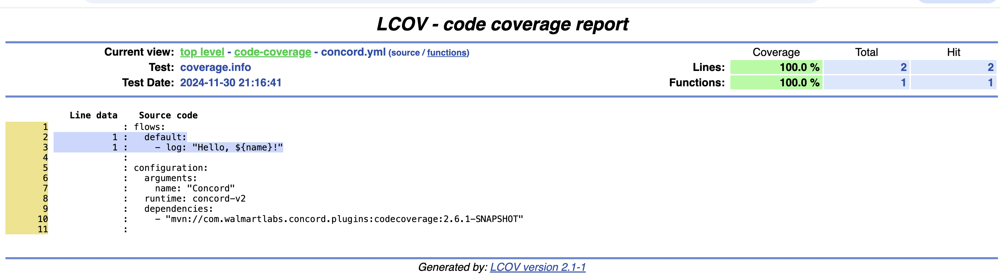

# {{ page.title }}

- [Usage](#usage)
- [Generated Files](#generated-files)
- [HTML Report Generation](#html-report-generation)
- [Script for Generating HTML Report](#script-for-generating-html-report)
- [Example using Concord CLI](#example-using-concord-cli)

The Code Coverage plugin provides insights into how much of your Concord flow
logic is covered during process execution. It saves the coverage information in
the widely used LCOV format, allowing you to analyze the coverage or generate a
detailed HTML report.

## Usage

To be able to use the task in a Concord flow, it must be added as a
[dependency](../processes-v2/configuration.html#dependencies):

```yaml
configuration:
  dependencies:
  - mvn://com.walmartlabs.concord.plugins:codecoverage:{{ site.concord_plugins_version }}
```

Once added, the plugin will automatically generate coverage information during
the execution of your Concord process

## Generated Files

At the end of the process execution, the plugin will produce the following files:

- `coverage.info`: The code coverage data in LCOV format;
- `flows.zip`: A ZIP archive containing the flow files of the executed process.

These files will be saved as part of the process
[attachments](../api/process.html#download-attachment).

## HTML Report Generation

You can generate an HTML report from the coverage.info file using the `genhtml`
utility from the LCOV package:

```bash
genhtml "coverage.info" --output-directory "html"
```

> **Notes**: Ensure you have the lcov package installed on your system to use
> the genhtml command.

Below is an example of the report generated for the `hello_world` flow:



### Script for Generating HTML Report

You can use the following Bash script to automate downloading the coverage
files, extracting the flows, and generating the HTML report:

```bash
#!/bin/bash

if [[ $# -lt 3 ]]; then
    echo "Usage: $0 <BASE_URL> <INSTANCE_ID> <TOKEN>"
    exit 1
fi

BASE_URL=$1
INSTANCE_ID=$2
TOKEN=$3

OUTPUT_DIR="./code-coverage"

FILES=("coverage.info" "flows.zip")
UNZIP_DIR="${OUTPUT_DIR}"

mkdir -p "$OUTPUT_DIR" "$UNZIP_DIR"

download_file() {
    local file_name=$1
    local download_url="${BASE_URL}/api/v1/process/${INSTANCE_ID}/attachment/${file_name}"
    local output_file="${OUTPUT_DIR}/${file_name}"

    echo "Downloading ${file_name} from ${download_url}..."

    if curl -H "Authorization: ${TOKEN}" -o "${output_file}" -L "${download_url}"; then
        echo "File downloaded successfully: ${output_file}"
    else
        echo "Failed to download the file: ${download_url}"
        exit 1
    fi
}

for file in "${FILES[@]}"; do
    download_file "$file"
done

ZIP_FILE="${OUTPUT_DIR}/flows.zip"

echo "Unzipping ${ZIP_FILE} into ${UNZIP_DIR}..."

if unzip -o "$ZIP_FILE" -d "$UNZIP_DIR"; then
    echo "File unzipped successfully to: ${UNZIP_DIR}"
else
    echo "Failed to unzip file: ${ZIP_FILE}"
    exit 1
fi

if (cd "${OUTPUT_DIR}" && genhtml "coverage.info" --output-directory "html"); then
    echo "HTML report generated successfully in: ${OUTPUT_DIR}/html"
else
    echo "Failed to generate HTML report"
    exit 1
fi
```

#### How the Script Works

Input Parameters:
  - accepts `BASE_URL`, `INSTANCE_ID`, and `TOKEN` as arguments.
  - these parameters are used to authenticate and retrieve the files from the Concord server.

Steps:
- download files:
  - downloads `coverage.info` and `flows.zip` from the specified Concord process instance.
- extract "source code":
  - unzips `flows.zip`.
- generate HTML report:
  - runs the `genhtml` command to generate the HTML report from `coverage.info` and flows.

Output:
  - the HTML report is saved in the `code-coverage/html` directory

### Example Using Concord CLI

The code coverage plugin also works with [Concord CLI](../cli/index.html):

```yaml
# concord.yml
configuration:
  runtime: "concord-v2"
  dependencies:
    - mvn://com.walmartlabs.concord.plugins:codecoverage:{{ site.concord_plugins_version }}

flows:
  default:
    - call: sayHello

  sayHello:
    - log: "Hi!"

  sayBye:
    - log: "Bye!"⏎ 
```

```
$ concord run
Starting...
14:24:47.541 [main] Hi!
14:24:47.543 [main] Generating code coverage info...
14:24:47.551 [main] Coverage info saved as attachment with name 'coverage.info'
...done!
```

```
$ genhtml target/_attachments/coverage.info --output-directory "html" 
```
